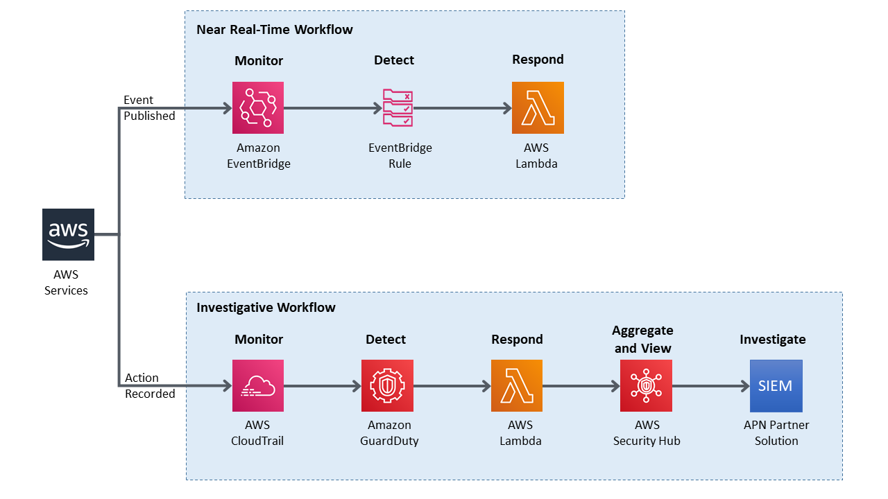

## Automatically Enable CloudTrail when Disabled

This example incorporates two automated responses: near real-time workflow and investigatory workflow.  The near real-time workflow prioritizes rapid response to an individual event, in this case stopping of a trail.  The goal is to restore the trail to functioning state and alert security responders as quickly as possible.  The investigatory workflow still includes a response to provide defense in depth, but it also incorporates services that facilitate a more in-depth investigation of the incident.

## License

This library is licensed under the MIT-0 License. See the LICENSE file.

